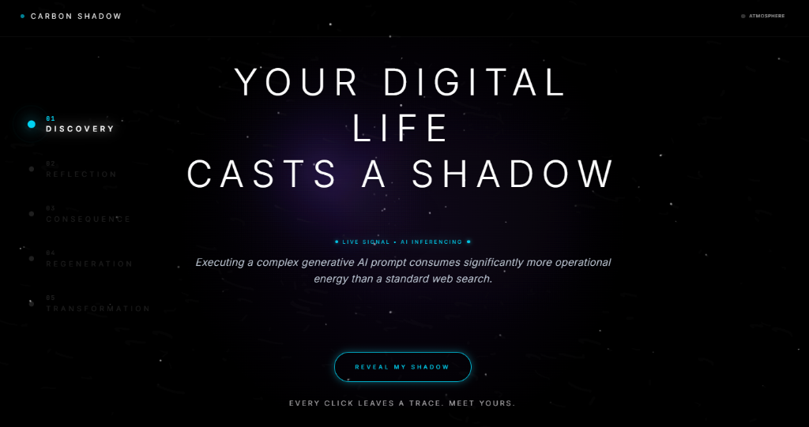
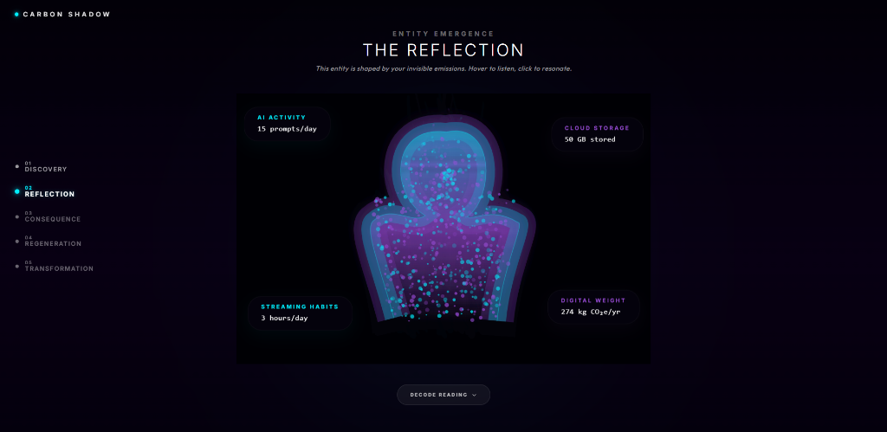
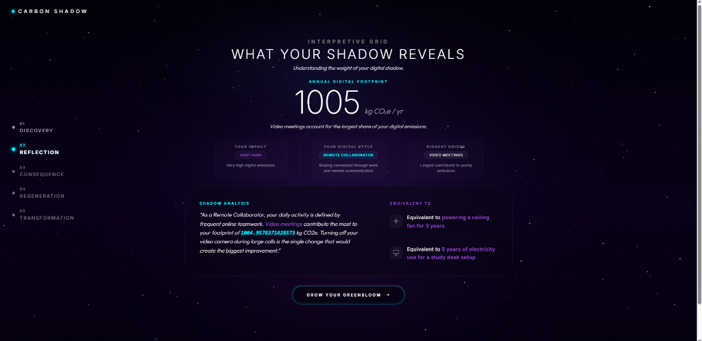
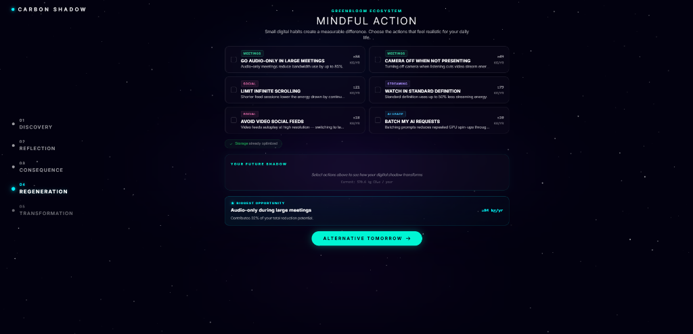
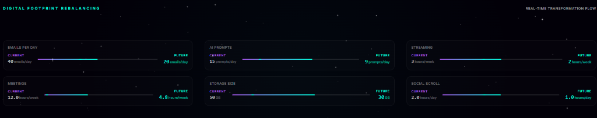
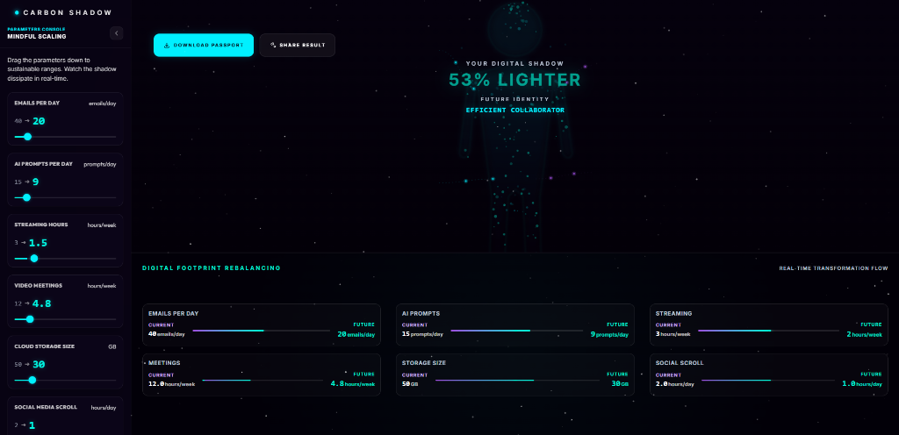
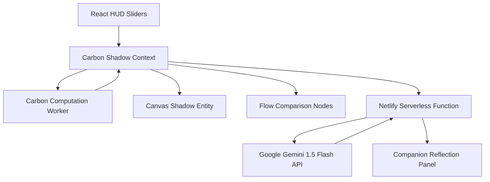

# 🌌 Carbon Shadow

### A Cognitive Mirror for Rebalancing Your Digital Footprint

🌐 **[Live Demo](https://carbonshadow.netlify.app)** 

📂 **[Source Code](https://github.com/Soumalya-De/carbon-shadow)**  

🎥 **[Demo Video](https://youtu.be/your-demo-video)**

[](https://www.netlify.com)
[](LICENSE)
[](https://reactjs.org/)
[](https://vitejs.dev/)
[](https://tailwindcss.com/)

Carbon Shadow is an interactive, cinematic web application that translates the invisible environmental weight of our daily digital lives into a responsive, animated "cognitive mirror." Instead of dry tables and intimidating charts, Carbon Shadow uses fluid particle simulations and advanced generative narration to represent your digital footprint. As you adjust your daily habits, your shadow dissipates in real-time, guiding you toward a balanced and sustainable digital lifestyle.

---

## 🏛️ Built For

**Carbon Shadow** was created for the **Hack2Skill Sustainability Challenge**. 

The project explores how invisible digital activities contribute to carbon emissions and translates those impacts into an interactive visual experience that encourages mindful digital behavior.

---

## 📸 Interface Preview


---

## 💡 Philosophy & Concept

Every email sent, every hour streamed, and every prompt given to an AI model triggers a physical sequence of activities in remote server farms, storage grids, and telecommunication networks. Because these systems are invisible, our digital footprint feels zero-weight.

Carbon Shadow makes this footprint tangible. Our core goals are:
- **Reflective, Not Restrictive**: We do not shame users or tell them to stop using digital tools. Instead, we offer a non-judgmental space to explore how minor choices accumulate.
- **Aesthetic Engagement**: Visualizing carbon footprints as an organic, breathing shadow entity (glowing violet and cyan) connects users emotionally to their data usage.
- **Actionable Redirection**: Translating abstract numbers (like `300 kg CO2e/year`) into simple, high-impact daily practices—like standard definition streaming or turning off the video camera in large meetings.

---

## 🗺️ Experience Flow

Carbon Shadow guides users through a progressive narrative journey across several stages:

### 01 Discovery

*Entering the void to establish baseline digital inputs and trace emissions.*

### 02 Reflection

*Confronting the digital reflection as the initial violet/purple Carbon Shadow materializes.*

### 03 Consequence

*Reading the AI-powered companion analysis detailing your shadow archetype.*

### 04 Regeneration

*Exploring mindful choices to offset and regenerate your footprint.*

### 05 Alternative Tomorrow

*Comparing the two futures side-by-side: baseline shadow vs. a light, clean emerald shimmer.*

### 06 Transformation

*Scaling parameters inside the live terminal to see the shadow dissipate and download your passport.*

---

## 📊 Tech Stack

| Layer | Technology |
|---------|------------|
| **Frontend** | React 18 |
| **Build Tool** | Vite |
| **Styling** | Tailwind CSS |
| **Animation** | HTML5 Canvas |
| **State Management** | React Context |
| **Background Processing** | Web Workers |
| **AI Layer** | Gemini API (via serverless bridge) |
| **Deployment** | Netlify |
| **Export Engine** | html-to-image |
| **Sharing** | Web Share API + Client QR Generator |

---

## ⚙️ System Architecture

The following diagram illustrates how Carbon Shadow processes parameters, runs multi-threaded computations, fetches generative summaries, and renders the canvas shadow:



---

## 🎯 Impact Highlights

Carbon Shadow helps users discover actionable, measurable reductions:
- **Up to 96% lower meeting emissions** through audio-only participation.
- **Up to 80% lower streaming footprint** using standard definition playback.
- **Reduced cloud storage overhead** through mindful data retention.
- **Lower AI workload** through prompt batching and intentional usage.

---

## 🎨 Why This Project is Different

- **Story-Driven Sustainability**: Instead of presenting users with standard dashboards and charts, Carbon Shadow guides them through a seven-stage narrative journey from awareness to transformation. This emotional connection is our strongest differentiator.
- **Non-Shaming, Community-First Tone**: Carbon Shadow respects modern open-source initiatives and works to unite, rather than divide. Rather than claiming digital technology is inherently harmful, we focus on mindful optimization.
- **Cognitive Mirror Concept**: Moving slider controls triggers immediate particle dissipation on an organic HTML5 canvas body, giving a before-and-after visual.
- **Dedicated Carbon Computation Worker**: All footprint calculations run inside a browser Web Worker to keep the interface responsive and ensure real-time updates without blocking rendering or animations.
- **Custom-Branded Share Modal**: Built with glassmorphism UI, a custom QR Code generator, and one-click integrations for LinkedIn, X (Twitter), Facebook, WhatsApp, Telegram, Threads, Instagram, Discord, and Email.

---

## 📁 Repository Directory Structure

```text
carbon-shadow/
├── .github/                 # GitHub workflows & templates
├── netlify/
│   └── functions/
│       └── gemini.js        # Netlify Serverless function (Gemini API bridge)
├── public/                  # Static assets (Favicons, screenshots)
│   ├── screenshot.png
│   ├── discovery.png
│   ├── reflection.png
│   ├── consequence.png
│   ├── regeneration.png
│   ├── alternative.png
│   └── transformation.png
├── src/
│   ├── assets/              # Static styles & local assets
│   ├── components/          # React components
│   │   ├── canvas/          # WebGL/Canvas rendering entities
│   │   ├── layout/          # Page layout structures
│   │   ├── scene/           # Page 1 to Page 7 scenes
│   │   └── ui/              # UI widgets (Sliders, Modals, backgrounds)
│   ├── context/             # Global CarbonShadow context provider
│   ├── hooks/               # Custom hooks (carbonWorker, useCanvasShadow, etc.)
│   ├── utils/               # Helper utils (imageExport, local storage)
│   ├── App.jsx              # Main App wrapper
│   ├── index.css            # Tailwind / global styles
│   └── main.jsx             # React entrypoint
├── LICENSE                  # MIT License details
├── netlify.toml             # Netlify deployment configuration
├── package.json             # NPM dependencies & scripts
├── tailwind.config.js       # Tailwind configuration file
└── vite.config.js           # Vite server configuration
```

---

## 💻 Local Development Setup

### Prerequisites
- Node.js (v18.x or higher)
- NPM (v10.x or higher)

### 1. Clone & Install Dependencies
```bash
git clone https://github.com/your-username/carbon-shadow.git
cd carbon-shadow
npm install
```

### 2. Configure Environment Variables
Create a `.env` file in the root directory:
```env
GEMINI_API_KEY=your_gemini_api_key_here
```

### 3. Run Development Server
To launch Vite's hot-reloading development server:
```bash
npm run dev
```
Open [http://localhost:5173](http://localhost:5173) in your browser.

### 4. Run Netlify Dev Server (Optional, for Serverless Functions)
To run the serverless backend functions locally, install the Netlify CLI and start the dev server:
```bash
npm install -g netlify-cli
netlify dev
```
This serves the application and bridges serverless backend routes (like `/.netlify/functions/gemini`) to local ports.

---

## ☁️ Netlify Deployment Guide

Deploying Carbon Shadow to Netlify takes just minutes:

1. **Connect Repository**: Push your code to GitHub, GitLab, or Bitbucket.
2. **Create New Site**: Log in to Netlify, click **Add New Site** ➔ **Import an existing project**, and select your repository.
3. **Configure Build Settings**:
   - **Build Command**: `npm run build`
   - **Publish Directory**: `dist`
   - **Netlify Functions Directory**: `netlify/functions` (automatically loaded from `netlify.toml`)
4. **Add Environment Variables**: Go to **Site settings** ➔ **Environment variables**, click **Add a variable**, and enter:
   - Key: `GEMINI_API_KEY`
   - Value: *[Your Gemini API Key]*
5. **Deploy**: Click **Deploy site**. Netlify will automatically build the React assets and deploy the Serverless Gemini API bridge.

---

## 📢 Spread the Word

Proudly show your pledge or how you can make a difference by sharing your story online with friends, family, and colleagues! By exporting your Carbon Shadow Passport, you inspire others to join the digital sustainability movement and amplify our collective footprint reduction.

---

## 🗺️ Future Roadmap

- **Real-world API integrations** for device and streaming analytics.
- **Personalized sustainability coaching** and automated habit analysis.
- **Multi-user community challenges** to crowdsource carbon reduction.
- **Historical footprint tracking** to monitor progress over time.
- **Team and organization dashboards** for collaborative digital audits.
- **Carbon reduction goal setting** with milestones and reward badges.

---

## 📄 License

This project is licensed under the MIT License - see the [LICENSE](LICENSE) file for details.

---

*Carbon Shadow transforms invisible digital consumption into a visible, emotional experience—helping users understand that even small digital habits can shape a more sustainable future.*
